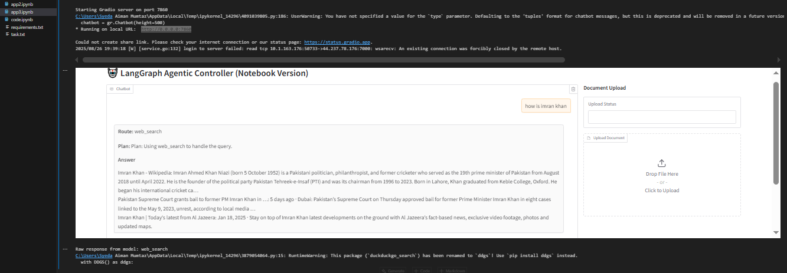
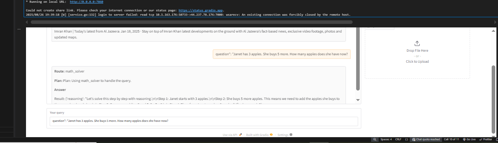
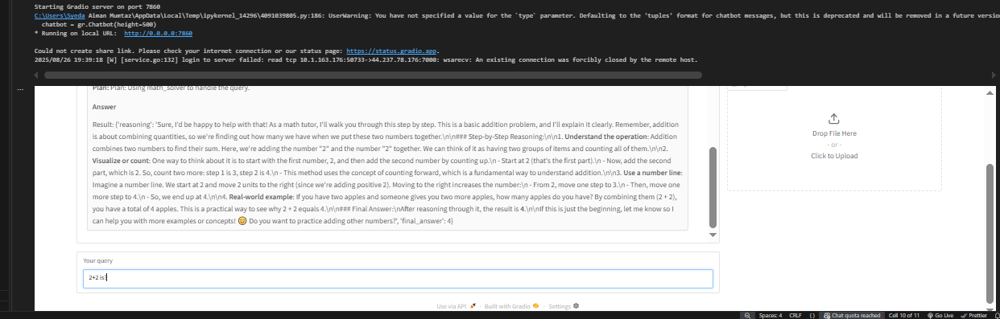
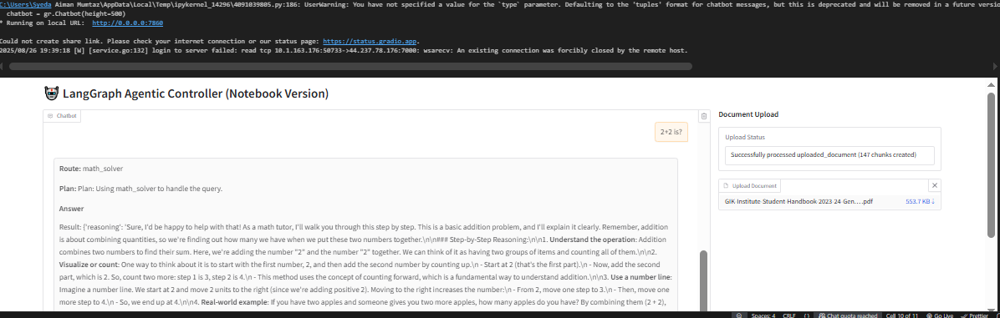
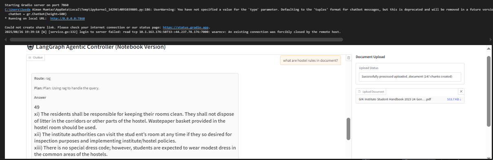

# 🛠️ Tool Calling AI Agent  
Lightweight agents capable of **task decomposition** and **dynamic tool selection**.  

## 🚀 System Components  

### 1. Controller Agent  (Deepseek r1 free api )
- **Input**: Receives a complex user query.  
- **Logic**: Uses a master prompt to decompose the query and create a step-by-step plan.  
- **Action**: Decides which tool to invoke for each step in the plan.  

### 2. Tool Interfaces (APIs)  
- **🌐 Web Search** → Fetches live information from the internet.  
- **🧮 Calculator** → Performs basic arithmetic operations.  
- **📘 Math Word Problem Solver** → Calls a model to reason and solve problems with app3.ipynb is zero-shot and app3-oneshot is one-shot.  
- **📂 Document Q&A** → Accesses and retrieves information from local PDF, DOCX, or TXT files.  

---
### Screenshots







## 📦 Installation  

Clone the repository and install dependencies:  

```bash
git clone https://github.com/your-username/Tool_calling_AI_Agent.git
cd Tool_calling_AI_Agent
pip install -r requirements.txt
